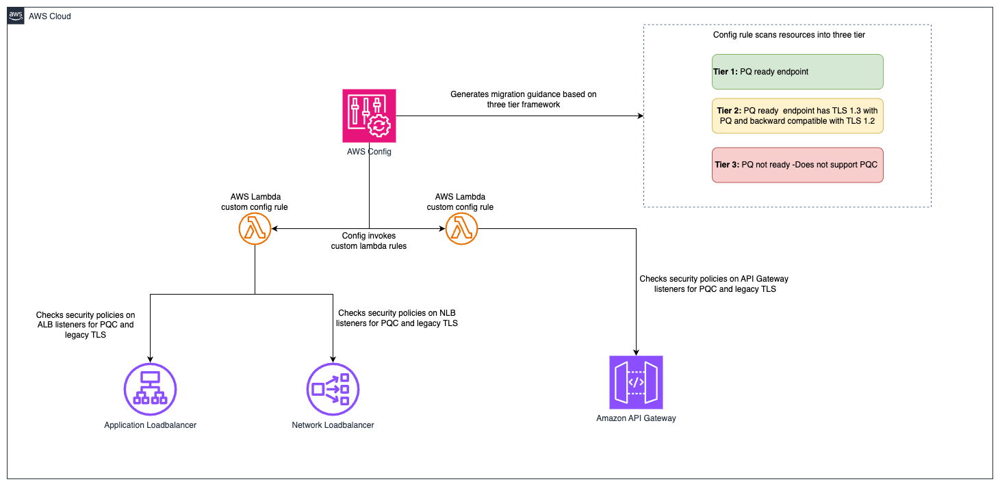

# PQC Readiness Scanner using AWS Config

Automated PQC readiness monitoring for AWS edge services (ALB, NLB and API Gateway) with simplified binary checks:

 **Is Post-Quantum Cryptography enabled?** 

 **Does the endpoint allow legacy TLS 1.0 or TLS1.1?** 

Uses AWS Config custom rules with Lambda functions to provide clear, actionable findings.

**Important:** This is a sample application and uses various AWS services and there are costs associated with these services after the Free Tier usage - please see the [AWS Pricing page](https://aws.amazon.com/config/pricing/) for details. You are responsible for any AWS costs incurred. No warranty is implied in this sample code.

---

## Table of Contents

1. [Quick Start (Single Account)](#quick-start-single-account)
2. [Multi-Account Deployment (Organizations)](#multi-account-deployment-organizations)
3. [Viewing Results (Organizations)](#viewing-results-organizations)
4. [Architecture](#architecture)
5. [Interpretation Guide](#interpretation-guide)
6. [Troubleshooting](#troubleshooting)
7. [Cleanup](#cleanup)
8. [License](#license)

---

## Quick Start (Single Account)

### Prerequisites

Before deploying, ensure you have:

- **AWS CLI** configured with credentials
  ```bash
  aws configure
  aws sts get-caller-identity  # Verify
  ```

- **AWS SAM CLI** installed ([Installation Guide](https://docs.aws.amazon.com/serverless-application-model/latest/developerguide/install-sam-cli.html))
  ```bash
  # macOS
  brew install aws-sam-cli
  
  # Verify
  sam --version
  ```

- **Python 3.12** (required by Lambda runtime)
  ```bash
  python3 --version  # Should show 3.12.x
  ```

- **AWS Config** enabled in your target account(s) and region(s) and recording these resource types:
  - `AWS::ElasticLoadBalancingV2::LoadBalancer`
  - `AWS::ApiGateway::RestApi`
  - `AWS::ApiGatewayV2::Api`
  
  Enable via [AWS Config Console](https://console.aws.amazon.com/config) → Recorder → Recording Strategy → [Select specific resource types](https://docs.aws.amazon.com/config/latest/developerguide/manual-setup.title.html) (Follow the steps in manual setup for AWS Config recording strategy for specific resource types)


### Deployment Steps

#### Step 1: Clone and Build

```bash
git clone https://github.com/aws-samples/sample-PQC-Readiness-using-AWS-Config.git
cd PQC-validation-using-config
sam build
```

#### Step 2: Deploy to One or More Regions

```bash
cd PQC-validation-using-config/installation

# Make script executable (first time only)
chmod +x deploy-per-regions.sh

# Deploy to a single region
./deploy-per-regions.sh us-east-1

# Deploy to multiple regions
./deploy-per-regions.sh us-east-1 us-west-2 eu-west-1
```

The script automatically:
- Deploys Lambda functions via SAM
- Deploys conformance pack (creates Config rules)
- Verifies deployment success
- Provides clear status messages

**That's it!** The scanner is now monitoring your ELB and API Gateway resources across all deployed regions.

---

## Multi-Account Deployment (Organizations)

For organization-wide deployment across multiple AWS accounts, use CloudFormation StackSets to deploy Lambda functions to each account.

**Important Constraint:** AWS Config `CUSTOM_LAMBDA` rules require the Lambda function to exist in the **same account** as the Config rule. You cannot use a centralized Lambda in one account to evaluate resources in other accounts.

### Prerequisite: Shared S3 Bucket

Before packaging, create an S3 bucket accessible by all target accounts in your organization. This bucket will host the Lambda deployment artifacts that CloudFormation StackSets pulls into each member account.

```bash
# Create the shared S3 bucket (run from management/central account)
aws s3 mb s3://<your-org-shared-bucket> --region us-east-1
```

Grant the bucket owner full management access and read access to the target accounts:

```bash
aws s3api put-bucket-policy \
  --bucket <your-org-shared-bucket> \
  --policy '{
    "Statement": [
      {
        "Sid": "BucketOwnerFullAccess",
        "Effect": "Allow",
        "Principal": {
          "AWS": "arn:aws:iam::<bucket-owner-account-id>:root"
        },
        "Action": "s3:*",
        "Resource": [
          "arn:aws:s3:::<your-org-shared-bucket>",
          "arn:aws:s3:::<your-org-shared-bucket>/*"
        ]
      },
      {
        "Sid": "CrossAccountReadAccess",
        "Effect": "Allow",
        "Principal": {
          "AWS": [
            "arn:aws:iam::<account-id-1>:root",
            "arn:aws:iam::<account-id-2>:root"
          ]
        },
        "Action": ["s3:GetObject", "s3:ListBucket"],
        "Resource": [
          "arn:aws:s3:::<your-org-shared-bucket>",
          "arn:aws:s3:::<your-org-shared-bucket>/*"
        ]
      }
    ]
  }'
```

Replace `<account-id-1>`, `<account-id-2>` with the AWS account IDs where StackSets will deploy the Lambda functions.

> **Note:** The bucket must be in the same region as the StackSet deployment regions. For multi-region deployments, create one bucket per region and run `sam package` separately for each.

### Step 1: Build and Upload Lambda Packages to S3

Run the packaging script from the `installation/` directory:

```bash
cd installation

# Make script executable (first time only)
chmod +x deploy-stacksets.sh

# Build, package, upload to S3, and generate resolved template
./deploy-stacksets.sh <your-org-shared-bucket>
```

This script automatically:
- Builds Lambda functions using SAM
- Creates ZIP packages
- Uploads ZIPs to the shared S3 bucket
- Generates `packaged-template.yaml` with S3 values baked in (no parameters needed at deploy time)

### Step 2: Deploy Lambda Functions via StackSets

Run the following from the **management account** (or delegated admin account):

```bash
# Create StackSet (--region sets the StackSet "home region" where it is managed)
aws cloudformation create-stack-set \
  --stack-set-name pqc-readiness-lambda-functions \
  --template-body file://installation/packaged-template.yaml \
  --capabilities CAPABILITY_IAM \
  --permission-model SERVICE_MANAGED \
  --auto-deployment Enabled=true,RetainStacksOnAccountRemoval=false \
  --region us-east-1

# Deploy stack instances to member accounts
# --regions = target regions where Lambda functions are deployed in member accounts
# --region  = must match the StackSet home region above
aws cloudformation create-stack-instances \
  --stack-set-name pqc-readiness-lambda-functions \
  --deployment-targets OrganizationalUnitIds=ou-xxxx-xxxxxxxx \
  --regions us-east-1 \
  --region us-east-1
```

> **Important — StackSet home region vs deployment regions:**
> - `--region` (on every CLI command) = the **StackSet home region** where the StackSet resource lives. All subsequent operations (describe, update, delete) must specify this same region.
> - `--regions` (on `create-stack-instances`) = the **deployment target region(s)** where stack instances are created in member accounts.
> - These are independent values. Always specify `--region` explicitly to avoid accidental deployment to your CLI's default region.

> **Note:** `SERVICE_MANAGED` StackSets must be created from the management or delegated admin account. The management account itself is excluded from stack instance deployments — use `deploy-per-regions.sh` separately if you need the scanner in the management account.

### Step 3: Deploy Organization Conformance Pack

```bash
aws configservice put-organization-conformance-pack \
  --organization-conformance-pack-name pqc-legacy-tls-compliance \
  --template-body file://conformance-packs/pqc-legacy-tls-conformance-pack.yaml \
  --region us-east-1
```

This creates Config rules in all member accounts that reference their local Lambda functions.

---

## Viewing Results (Organizations)

In each **member account**, navigate to [AWS Config Console](https://console.aws.amazon.com/config/) in the deployed region.

### Conformance Pack View

Go to **AWS Config → Conformance packs** and look for:

```
OrgConformsPack-pqc-legacy-tls-compliance-<suffix>
```

> **Note:** Organization conformance packs are prefixed with `OrgConformsPack-` and have a random suffix appended (e.g., `OrgConformsPack-pqc-legacy-tls-compliance-gyv22je0`).

Click the conformance pack to see an overall compliance summary across all 4 rules.

### Individual Rules View

Go to **AWS Config → Rules** and find 4 rules with prefix `pqc-`:

- `pqc-elb-pqc-compliance-conformance-pack-<suffix>`
- `pqc-elb-legacy-tls-conformance-pack-<suffix>`
- `pqc-apigateway-pqc-compliance-conformance-pack-<suffix>`
- `pqc-apigateway-legacy-tls-conformance-pack-<suffix>`

Click any rule to view:
- Compliant vs non-compliant resource counts
- Detailed annotations for each resource
- Resource ARNs and current security policy configurations

### AWS CLI

```bash
# Get compliance summary for all rules
aws configservice get-compliance-summary-by-config-rule --region <region>

# Get detailed results for a specific rule
aws configservice get-compliance-details-by-config-rule \
    --config-rule-name pqc-elb-pqc-compliance-conformance-pack-<id> \
    --region <region>

# Trigger manual evaluation
aws configservice start-config-rules-evaluation \
    --config-rule-names <rule-name-1> <rule-name-2> <rule-name-3> <rule-name-4> \
    --region <region>
```

---

## Architecture

### What This Solution Provides

**4 Config Rules monitoring 2 critical security checks:**

| Rule Name | Service | Check Type | Reports |
|-----------|---------|------------|---------|
| `elb-pqc-compliance` | ELB/ALB/NLB | PQC Enabled? | COMPLIANT if all listeners use PQC policies |
| `elb-legacy-tls` | ELB/ALB/NLB | Allows TLS 1.0/1.1? | NON_COMPLIANT if any listener allows legacy TLS |
| `apigateway-pqc-compliance` | API Gateway | PQC Enabled? | COMPLIANT if all domains use PQC policies |
| `apigateway-legacy-tls` | API Gateway | Allows TLS 1.0/1.1? | NON_COMPLIANT if any domain allows legacy TLS |

**2 Lambda Functions powered by explicit policy allowlists:**
- `ELBComplianceFunction` - Evaluates ELB/ALB/NLB listener security policies
- `APIGatewayComplianceFunction` - Evaluates API Gateway domain security policies

Each Lambda accepts a `checkType` parameter (`PQC` or `LEGACY_TLS`) to perform the appropriate check.

### Architecture Diagram



### Policy Reference Lists

The scanner uses explicit policy allowlists based on official AWS documentation:

**ELB PQC Policies (10 total):**
```
ELBSecurityPolicy-TLS13-1-3-PQ-2025-09
ELBSecurityPolicy-TLS13-1-2-Res-PQ-2025-09
ELBSecurityPolicy-TLS13-1-2-PQ-2025-09
ELBSecurityPolicy-TLS13-1-2-FIPS-PQ-2025-09
... (6 more)
```

**ELB Legacy TLS Policies (8 that allow TLS 1.0/1.1):**
```
ELBSecurityPolicy-TLS13-1-0-2021-06
ELBSecurityPolicy-2016-08
ELBSecurityPolicy-TLS-1-1-2017-01
... (5 more)
```

**API Gateway PQC Policies (2 total):**
```
SecurityPolicy_TLS13_1_2_PFS_PQ_2025_09
SecurityPolicy_TLS13_1_2_PQ_2025_09
```

**API Gateway Legacy TLS Policy (1 policy):**
```
TLS_1_0  (allows TLS 1.0, 1.1, 1.2, 1.3)
```

### Smart Scoping

**✅ Evaluated:**
- ELB/ALB/NLB listeners with HTTPS/TLS/TCP_SSL
- API Gateway Regional endpoints
- API Gateway Private endpoints

**❌ Excluded (NOT_APPLICABLE):**
- CloudFront distributions (PQC enabled by default)
- API Gateway Edge-optimized endpoints (inherit CloudFront PQC)

---

## Interpretation Guide

### PQC Compliance Check

| Status | Meaning | Action |
|--------|---------|--------|
| ✅ COMPLIANT | All endpoints use PQC-ready policies | No action needed |
| ❌ NON_COMPLIANT | At least one endpoint uses non-PQC policy | **CRITICAL**: Enable PQC immediately |
| ⚪ NOT_APPLICABLE | No secure listeners or edge-optimized API | No action needed |

**Example Annotations:**
```
✅ "All 2 listeners use PQC-ready policies"
❌ "Listener on port 443 uses non-PQC policy: ELBSecurityPolicy-2016-08. 
    Recommended: ELBSecurityPolicy-TLS13-1-2-Res-PQ-2025-09"
```

### Legacy TLS Check

| Status | Meaning | Action |
|--------|---------|--------|
| ✅ COMPLIANT | No endpoints allow TLS 1.0 or 1.1 | No action needed |
| ❌ NON_COMPLIANT | At least one endpoint allows TLS 1.0/1.1 | **HIGH PRIORITY**: Upgrade policy |
| ⚪ NOT_APPLICABLE | No secure listeners or edge-optimized API | No action needed |

**Example Annotations:**
```
✅ "Listener does not allow TLS 1.0/1.1. Policy: ELBSecurityPolicy-TLS13-1-2-2021-06"
❌ "Listener on port 443 allows TLS 1.0/1.1: ELBSecurityPolicy-2016-08. 
    HIGH PRIORITY: Upgrade to policy without TLS 1.0/1.1 support"
```

---

### Recommended Security Policies

**For ELB/ALB/NLB:**
- **Balanced (recommended):** `ELBSecurityPolicy-TLS13-1-2-Res-PQ-2025-09`
- **Maximum security:** `ELBSecurityPolicy-TLS13-1-3-PQ-2025-09`
- **FIPS compliance:** `ELBSecurityPolicy-TLS13-1-2-Res-FIPS-PQ-2025-09`

**For API Gateway:**
- **Recommended:** `SecurityPolicy_TLS13_1_2_PQ_2025_09`
- **With Perfect Forward Secrecy:** `SecurityPolicy_TLS13_1_2_PFS_PQ_2025_09`

### Pre-Remediation Checklist

- [ ] Enable ELB access logs (analyze client TLS usage patterns)
- [ ] Review 30-day client compatibility baseline
- [ ] Test policy changes in non-production environment
- [ ] Prepare rollback procedures
- [ ] Schedule maintenance windows
- [ ] Document client notification requirements

---

## Troubleshooting

### Common Issues

| Issue | Solution |
|-------|----------|
| Config rule not evaluating | Verify AWS Config is recording the resource type |
| "No resources found" | Wait 10-15 minutes after enabling Config recording |
| Script fails with "Config not enabled" | Enable AWS Config in the target region first |
| Permission denied | Ensure credentials have IAM permissions for Lambda, Config, CloudFormation |
| "Edge-optimized API" marked NOT_APPLICABLE | Expected - these inherit PQC from CloudFront |

### Viewing Lambda Logs

```bash
# ELB Lambda logs
aws logs tail /aws/lambda/pqc-readiness-config-scanner-ELBComplianceFunction --follow --region <region>

# API Gateway Lambda logs
aws logs tail /aws/lambda/pqc-readiness-config-scanner-APIGatewayComplianceFunction --follow --region <region>
```

### Force Re-evaluation

```bash
# Get rule names (they have unique suffixes)
aws configservice describe-config-rules \
  --query 'ConfigRules[?contains(ConfigRuleName, `pqc`)].ConfigRuleName' \
  --region <region>

# Trigger evaluation for all 4 rules
aws configservice start-config-rules-evaluation \
  --config-rule-names <rule-1> <rule-2> <rule-3> <rule-4> \
  --region <region>
```

### Config Recording Settings

If Config isn't discovering resources, verify recording settings:

```bash
# Check current recording strategy
aws configservice describe-configuration-recorders \
  --query 'ConfigurationRecorders[0].recordingGroup' \
  --region <region>

# Should show:
# - recordingStrategy.useOnly: "INCLUSION_BY_RESOURCE_TYPES"
# - resourceTypes: [AWS::ElasticLoadBalancingV2::LoadBalancer, AWS::ApiGateway::RestApi, AWS::ApiGatewayV2::Api]
```

---

## Cleanup

### Single Account Cleanup

```bash
# Delete conformance pack (removes 4 Config rules)
aws configservice delete-conformance-pack \
    --conformance-pack-name pqc-legacy-tls-compliance \
    --region <region>

# Delete SAM stack (removes Lambda functions and IAM roles)
aws cloudformation delete-stack \
    --stack-name pqc-readiness-config-scanner \
    --region <region>
```

### Multi-Region Cleanup

```bash
# Delete from multiple regions
for REGION in us-east-1 us-west-2 eu-west-1; do
  echo "Cleaning up $REGION..."
  aws configservice delete-conformance-pack \
    --conformance-pack-name pqc-legacy-tls-compliance \
    --region $REGION
  aws cloudformation delete-stack \
    --stack-name pqc-readiness-config-scanner \
    --region $REGION
done
```

### Multi-Account Cleanup (StackSets)

```bash
# Delete stack instances from all accounts
aws cloudformation delete-stack-instances \
    --stack-set-name pqc-readiness-lambda-functions \
    --deployment-targets OrganizationalUnitIds=ou-xxxx-xxxxxxxx \
    --regions us-east-1 us-west-2 \
    --no-retain-stacks

# Wait for deletion (~5 minutes), then delete StackSet
aws cloudformation delete-stack-set \
    --stack-set-name pqc-readiness-lambda-functions

# Delete organization conformance pack
aws configservice delete-organization-conformance-pack \
    --organization-conformance-pack-name pqc-legacy-tls-compliance
```

## License

This library is licensed under the MIT-0 License. See the LICENSE file.

---

## References

- [ELB Security Policies Documentation](https://docs.aws.amazon.com/elasticloadbalancing/latest/application/describe-ssl-policies.html)
- [API Gateway Security Policies Documentation](https://docs.aws.amazon.com/apigateway/latest/developerguide/apigateway-security-policies-list.html)
- [AWS Post-Quantum Cryptography](https://aws.amazon.com/security/post-quantum-cryptography/)
- [API Gateway Enhanced TLS Policies Blog](https://aws.amazon.com/blogs/compute/enhancing-api-security-with-amazon-api-gateway-tls-security-policies/)
- [AWS Config Custom Lambda Rules](https://docs.aws.amazon.com/config/latest/developerguide/evaluate-config_develop-rules_nodejs.html)
- [AWS SAM Developer Guide](https://docs.aws.amazon.com/serverless-application-model/latest/developerguide/what-is-sam.html)


*PQC Readiness Scanner*  
*Built with AWS SAM | Powered by AWS Config*